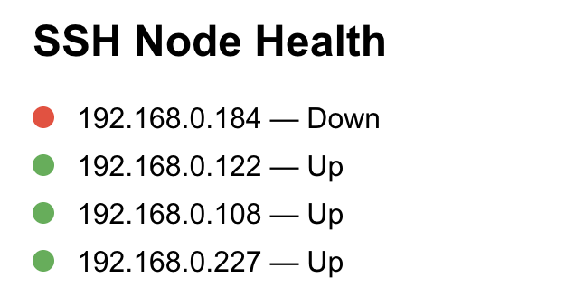
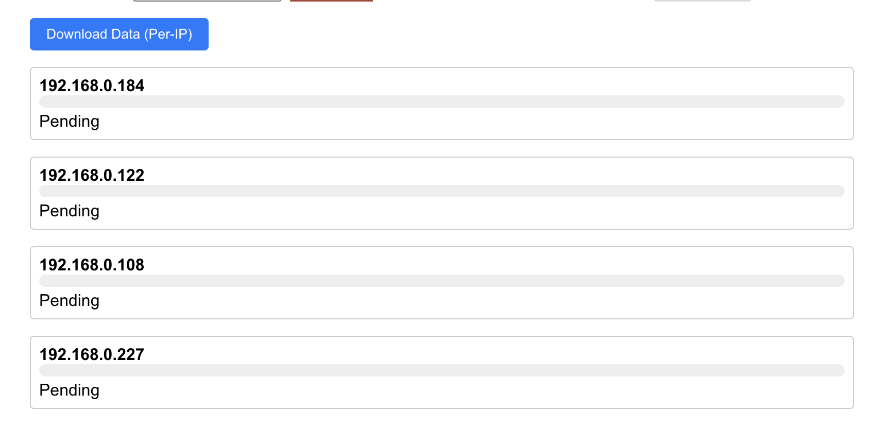

# StreetAware Project - Data Collection & Synchronization Toolkit

This guide covers the complete workflow for the StreetAware project, from data collection to advanced video synchronization and repair. All steps are streamlined for clarity and professional use.

## 1. App Setup - Using Bash Script

### Clone the repository:

```
git clone https://github.com/VIDA-NYU/StreetAware-collection.git
```

### Make scripts executable:

```
chmod +x setup.sh run.sh stop.sh
```

### Run setup:

```
./setup.sh
```

---

## 2. App Run - Using Bash Script

### Start the app:

```
./run.sh
```

### Stop the app:

```
./stop.sh
```
---

## 3. How to Use the App

### - Health Check

The app includes a UI section for **health checks**. Below is a sample image indicating what the health check screen looks like. This helps verify if sensors are connected and responsive.



### - Collect Data

To begin collecting sensor data:

1. In the **Collect Data** section of the app UI, set a value (in seconds) for:
   - **Total Collection Duration**
   - **Session Timeout**

2. Click the **Start SSH & Collect** button.

3. To stop data collection manually before timeout, use the **Stop Job** button.


### - Download Data to Local Device

After the collection is complete:



- Click on **Download Data (per-ip)**.
- This will fetch sensor data to your local machine.

Downloaded data is stored at:

```
street-aware-scripts/data/<current-date>
```


You can then upload the collected data to the **Research Space** for future analysis. [! Note: Currently the video files generated are not research ready and needs some header fixes required to be implemented. See **fix_avi_header.py** in the next section]

---

## 4. Video Synchronization & Processing Toolkit

### Prerequisites
- Python 3.7+
- OpenCV (with Python bindings)
- NumPy
- natsort
- ffmpeg (for AVI repair)
- GStreamer with Python bindings (optional, for GPU-accelerated encoding)

Install dependencies:
```bash
cd street-aware-scripts
pip install -r requirements.txt
```

### Script Summary

#### Basic Analysis
- **check_frame_count.py**: Analyze available frames and timeline data.
  ```bash
  python check_frame_count.py <data_path>
  ```

#### Core Synchronization Scripts
- **video_sync.py**: **RECOMMENDED** - Comprehensive video synchronization for 4K multi-camera setup with GPU support.
  ```bash
  python video_sync.py <data_path> [--output-dir OUTPUT_DIR] [--threshold THRESHOLD] [--max-frames MAX_FRAMES] [--fps FPS] [--rotation ROTATION]
  ```
  Options:
  - `data_path`: Path to data directory containing camera folders (required)
  - `--output-dir`: Output directory for synchronized videos (default: `synchronized_output`)
  - `--threshold`: Synchronization threshold in milliseconds (default: 100)
  - `--max-frames`: Maximum number of frames to process (optional)
  - `--fps`: Output video frame rate (default: 20)
  - `--rotation`: Rotation angle: 0, 90, 180, or 270 degrees (default: 0)


#### Video Repair
- **fix_avi_header.py**: Repair corrupted AVI headers (requires ffmpeg).
  ```bash
  python fix_avi_header.py <data_path> [--backup] [--cameras CAM1 CAM2 ...] [--test-only] [--verify-only] [--analyze-only]
  ```

**Tip:** All scripts support `--help` for option details.

### Output Structure

All synchronization scripts create organized output folders:

```
synchronized_output/              # or your specified --output-dir
├── per_camera/                   # Individual synced videos per camera
│   ├── 192.168.0.108_0_enhanced_sync.mp4
│   ├── 192.168.0.108_2_enhanced_sync.mp4
│   ├── 192.168.0.122_0_enhanced_sync.mp4
│   └── ...
└── mosaic/                       # Mosaic video and metadata
    ├── mosaic_enhanced_sync.mp4
    ├── enhanced_sync_tracking.json
    └── master_timeline_enhanced.json
```

---

## 5. Reference & Updates
For the most up-to-date documentation and updates, refer to the following Google Doc:

👉 [StreetAware Master Documentation](https://docs.google.com/document/d/1m13t26RZbAX_EhKLEvc13xLq-o2AdOja44-rMRILN5U/edit?usp=sharing)

